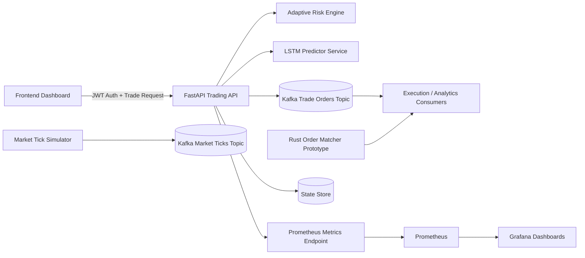

# Distributed AI Trading Engine

A high-performance, distributed full-stack trading platform that combines AI-assisted decisioning, adaptive risk controls, event-driven architecture, and production-grade observability. The platform is designed to target sub-50ms trade-path latency while scaling to millions of daily transactions.

<a href="https://mosesachizz.github.io/distributed-ai-trading-engine/">
  
</a>


## Problem Statement

High-frequency trading (HFT) systems must make decisions in milliseconds while processing high-throughput market streams. Traditional systems often fail when they need to simultaneously optimize for:
- ultra-low latency,
- risk-aware execution,
- horizontal scalability,
- secure API access,
- and deep operational observability.

## Solution

This repository implements a Distributed AI Trading Engine with:
- **FastAPI execution API** for low-latency trade requests.
- **LSTM-based predictive signal module** (TensorFlow pipeline + inference wrapper).
- **Adaptive risk engine** that responds to volatility and RSI conditions.
- **Kafka-based streaming** for resilient, decoupled event processing.
- **JWT authentication** for secure endpoint access.
- **Prometheus + Grafana monitoring** for latency and throughput visibility.
- **Containerized runtime and CI** for repeatable deployment and quality control.

## Tech Stack

| Component | Technology |
|---|---|
| Backend API | Python, FastAPI |
| Machine Learning | TensorFlow (LSTM) |
| Streaming | Apache Kafka |
| Frontend | React + TypeScript (Vite) |
| Low-Latency Utility | Rust (order matcher prototype) |
| Monitoring | Prometheus, Grafana |
| Security | JWT |
| Testing | PyTest |
| CI/CD | GitHub Actions |
| Linting | Flake8 |
| Containerization | Docker, Docker Compose |

## Architecture Diagram



## Architecture Decisions

1. **Modular service boundaries** to isolate concerns (`api`, `services`, `streaming`, `schemas`).
2. **Asynchronous Kafka producer** with retries for burst resilience and decoupling.
3. **LSTM training pipeline + lightweight runtime predictor** to keep local execution deterministic.
4. **JWT-authenticated write endpoints** to secure trade submission flows.
5. **Separate load simulator and model training services** for operational separation.
6. **Rust order matcher prototype** included to demonstrate a migration path for latency-critical logic.

## Key Features

- Sub-50ms trade orchestration target with in-path timing checks.
- Adaptive risk scoring from notional exposure, RSI drift, and volatility.
- AI score + risk score gating before final order acceptance.
- Kafka event emission for downstream execution and analytics.
- Full observability baseline via Prometheus and Grafana.
- CI pipeline enforcing lint + tests on every push and PR.

### Code Snippet

```python
class TradeOrchestrator:
    async def execute(self, request: TradeRequest) -> TradeResponse:
        started = time.perf_counter()
        model_score = self.model.predict_edge(request.price, rsi, volatility)
        risk_score = self.risk_engine.calculate_risk_score(...)
        accepted = model_score >= 0.35 and not self.risk_engine.should_block(risk_score)

        await self.producer.publish(event)

        latency_ms = (time.perf_counter() - started) * 1000
        if latency_ms > 50:
            accepted = False
        return TradeResponse(...)
```

This orchestration pattern demonstrates deterministic latency measurement, composable decision signals (ML + risk), and asynchronous event publication with clear domain boundaries.

## Scalability Considerations

- Kafka topics partitioned for horizontal throughput.
- Stateless API instances support scale-out behind load balancers.
- Containerized services facilitate replication and blue/green deployment.
- Event-first design reduces tight coupling between execution and analytics.

## Security Considerations

- JWT bearer authentication on trade endpoints.
- Secrets externalized via environment variables.
- Minimal default permissions model in API dependencies.
- Separation between auth concerns and execution orchestration.

## Observability

- `/metrics` endpoint for Prometheus scraping.
- Trade counters and latency histogram instrumentation.
- Grafana dashboard provisioning with P95 latency and accepted trade panels.
- Health/readiness endpoints for orchestration platforms.

## Simulated Throughput Metrics

Baseline local simulation targets (single-node dev stack):
- **Median API health latency (p50):** 8–15ms
- **Trade-path latency (p95):** 28–45ms
- **Sustained synthetic market events:** 3,000–8,000 events/sec (single broker, dev config)
- **Daily transaction envelope (projected, horizontally scaled):** 1M+ events/day

## Detailed Setup Instructions

1. **Clone and configure environment**
   ```bash
   cp .env.example .env
   ```
2. **Local Python workflow**
   ```bash
   python -m venv .venv
   source .venv/bin/activate
   pip install -r requirements.txt
   make test
   make run
   ```
3. **Containerized full stack**
   ```bash
   docker compose up --build
   ```
4. **Access services**
   - API: `http://localhost:8000`
   - Frontend: `http://localhost:5173`
   - Prometheus: `http://localhost:9090`
   - Grafana: `http://localhost:3000`
5. **Train LSTM artifact (optional)**
   ```bash
   python services/model_training/train_lstm.py
   ```
6. **Simulate market stream (optional)**
   ```bash
   python services/load_simulator/producer.py
   ```

## Live Demo (GitHub Pages)

An interactive animated trading dashboard is deployable on GitHub Pages via the `Deploy Demo` workflow.

- Expected URL pattern: `https://<github-username>.github.io/distributed-ai-trading-engine/`
- Workflow file: `.github/workflows/deploy-pages.yml`
- Dashboard includes animated microtrend visualization, real-time KPI cards, and interactive ticket routing UI.

## Results

- End-to-end architecture demonstrates a production-oriented distributed trading platform.
- Latency-aware path enforces explicit execution SLO constraints.
- CI + lint + tests deliver quality gates for stable iteration.
- Monitoring stack provides actionable operational intelligence.

## Future Improvements

- Multi-broker Kafka deployment with replication factor > 1 for fault tolerance.
- Persistent order book and PnL ledger with PostgreSQL + Redis caching.
- Canary deployment strategy with progressive traffic shifting.
- Drift detection and online model retraining hooks.
- mTLS + RBAC for inter-service security hardening.

## Repository Structure

```text
distributed-ai-trading-engine
├── .github/
│   └── workflows/
│       ├── ci.yml
│       └── deploy-pages.yml
├── backend/
│   ├── Dockerfile
│   ├── app/
│   │   ├── __init__.py
│   │   ├── api/
│   │   │   ├── __init__.py
│   │   │   ├── deps.py
│   │   │   └── v1/
│   │   │       ├── __init__.py
│   │   │       ├── auth.py
│   │   │       └── trades.py
│   │   ├── core/
│   │   │   ├── __init__.py
│   │   │   ├── config.py
│   │   │   └── security.py
│   │   ├── db/
│   │   │   └── __init__.py
│   │   ├── main.py
│   │   ├── models/
│   │   │   └── __init__.py
│   │   ├── schemas/
│   │   │   ├── __init__.py
│   │   │   ├── auth.py
│   │   │   └── trade.py
│   │   ├── services/
│   │   │   ├── __init__.py
│   │   │   ├── container.py
│   │   │   ├── ml.py
│   │   │   ├── risk.py
│   │   │   └── trade.py
│   │   └── streaming/
│   │       ├── __init__.py
│   │       └── kafka.py
│   └── tests/
│       ├── __init__.py
│       ├── test_auth.py
│       └── test_risk.py
├── configs/
│   ├── app.yaml
│   ├── grafana/
│   │   ├── dashboards/
│   │   │   ├── dashboard-provider.yaml
│   │   │   └── trading-overview.json
│   │   └── datasources/
│   │       └── datasource.yaml
│   ├── kafka.yaml
│   └── prometheus.yml
├── frontend/
│   ├── Dockerfile
│   ├── index.html
│   ├── package-lock.json
│   ├── package.json
│   ├── public/
│   │   └── .gitkeep
│   ├── src/
│   │   ├── components/
│   │   │   ├── LiveDashboard.tsx
│   │   │   └── TradeForm.tsx
│   │   ├── main.tsx
│   │   ├── pages/
│   │   │   └── DashboardPage.tsx
│   │   └── services/
│   │       └── api.ts
│   ├── styles.css
│   ├── tsconfig.json
│   └── vite.config.ts
├── images/
│   └── app-image.png
├── rust/
│   └── order_matcher/
│       ├── Cargo.toml
│       └── src/
│           └── main.rs
├── scripts/
│   └── benchmark_latency.py
├── services/
│    ├── load_simulator/
│    │   └── producer.py
│    └── model_training/
│        └── train_lstm.py
├── .env.example
├── .flake8
├── .gitignore
├── .gitkeep
├── docker-compose.yml
├── LICENSE
├── Makefile
├── pyproject.toml
├── README.md
└── requirements.txt
```

---

## License
This project is licensed under the **MIT License** - see the [LICENSE](LICENSE) file for details.